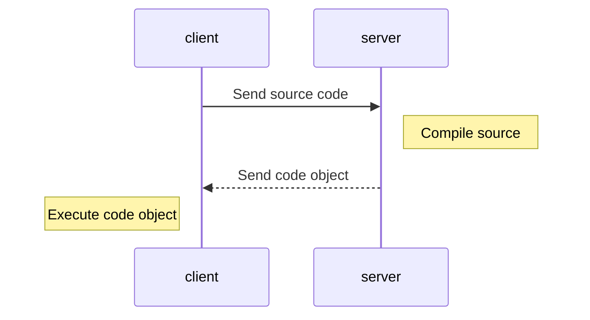

# Live Patching IDLE for Friendlier Tracebacks

In this document, I explain how friendly_idle is implemented.
This is currently work in progress.

What I need to do:

* [ ] Give an overview of friendly_idle
  - [ ] Include using console helpers
* [ ] Explain how friendly_traceback, friendly, friendly_idle work together
  * [ ] Explain how friendly on its own works with IDLE, including its limitations.
* [ ] Explain the customization of linecache done by IDLE and how friendly works with it
* [ ] Explain the RPC server used by IDLE
* [ ] Explain how live code patching can be done using import hooks
* [ ] Explain the limitation of custom exception hooks in IDLE
* [ ] Explain what happens when the shell is restarted
* [ ] Explain what happens when a module is run from an editor window
  - [ ] Include the case where a SyntaxError is raised


## Live Patching Using an Import Hook.

Python is a dynamic language which allow users to change the nature of
objects at runtime. This includes something known as 'monkeypatching'
where an attribute or method of an object is replaced by a new one.
The way monkeypatching is normally used is that a user first import an
object from a module and then replace the desired attribute or method on that
object.  If that module has been first imported elsewhere, previous instances
of that object are not modified.

The approach I used is to use an 'import hook' to ensure that the desired
object is modified whenever it is imported. Since the target object
is always modified before it is used for the first time, even if it is imported multiple
times in different subprocesses, I prefer to use 'live patching' instead
of monkeypatching.

When Python imports a module, it first has to find the module,
using a 'finder', before executing the code using a 'loader'.
Python can use different finders and loaders, depending on 
the type of the desired module: it could be a .py file, or a file
that was the result of compiling some C code, etc.
Each different type requires the use of a different finder.
Python goes through each finder in turn until one of them
finds the desired module and processes it.
All of these finders are stored in the `sys.meta_path` list.
In pseudocode, this process can be written as follows:

```python
for finder in sys.meta_path:
    if finder.finds(module_name):
        module = finder.loader(module_name)
        return module
raise ModuleNotFoundError
```

Please note that the above pseudocode only captures the essence
of what happens, and is not a true depiction of the actual code.

Using some similar pseudocode, the live patching done can
be summarized up as follows:

```python

sys.meta_path.insert(0, custom_finder)
for finder in sys.meta_path:
    if finder.finds(module_name):
        if finder == custom_finder:
            # restart the search again
            for finder in sys.meta_path:
                if finder.finds(module_name) and finder != custom_finder:
                    module = finder.loader(module_name)
                    module = patch(module)
                    return module
            raise ModuleNotFoundError
        else:
            module = finder.loader(module_name)
            return module
raise ModuleNotFoundError   
```

In practice, what is done is different: custom_finder maintains a list
of module to ignore, and appends `module_name` to this list after
finding it for the first time. However, the above pseudocode captures
the essense of what is done.


IDLE does not follow the normal development practice adopted for other module or packages
included in Python's standard library: new features are often ported back to previous
"minor" versions. For example, *partial* support for `sys.excepthook()` was
[introduced in Python 3.10](https://docs.python.org/3/whatsnew/3.10.html#idle-and-idlelib]
and backported to 3.9.5 and 3.8.10.

*Note: The following diagram is just a first draft. Many more diagrams will need to be added.*


The client above is some code found in `idlelib.run.py` and the server is found in `idlelib.pyshell.py`.

When a new process is started, the old client is stopped and a new client is started.
Since we patch the running code (as opposition to patching the code saved in a .py file),
we must repeat the patching every time a new client is started.